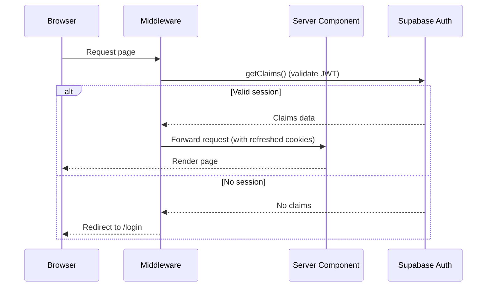

# Auth Flow — Expiry Guard

> Last updated: 2026-05-10

## Overview

Expiry Guard uses **email/password authentication** via Supabase Auth with the **PKCE flow** for server-side rendering in Next.js (App Router).

## Architecture

```
Browser → middleware.ts → lib/supabase/proxy.ts → getClaims() → Route
```

### Key Files

| File | Purpose |
|------|---------|
| `src/lib/supabase/client.ts` | Browser-side client (singleton via `createBrowserClient`) |
| `src/lib/supabase/server.ts` | Server-side client (per-request via `createServerClient`) |
| `src/lib/supabase/proxy.ts` | Session refresh logic (validates JWT via `getClaims()`) |
| `src/middleware.ts` | Next.js middleware entry point |
| `src/app/login/page.tsx` | Login/signup UI |
| `src/app/login/actions.ts` | Server actions: `login()`, `signup()` |
| `src/app/auth/confirm/route.ts` | Email verification token exchange |
| `src/app/auth/signout/route.ts` | Server-side sign-out |

## Security Rules

1. **Always use `getClaims()`** on the server — never trust `getSession()` for auth decisions.
2. **Publishable key** (`sb_publishable_...`) used in `NEXT_PUBLIC_` env vars — safe for browser exposure.
3. **Service role key** is never exposed in client code.
4. **Middleware** runs on every request (except static assets) to refresh auth tokens.
5. **Unauthenticated users** are redirected to `/login` by the proxy middleware.

## Flow Diagram


